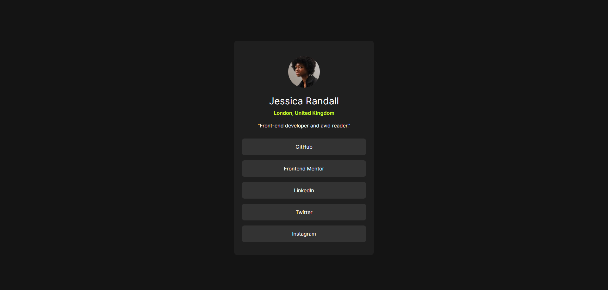

# Steph - Social links profile solution

This is a solution to the [Social links profile challenge on Frontend Mentor](https://www.frontendmentor.io/challenges/social-links-profile-UG32l9m6dQ). 

## Overview

### Screenshot

### Links

- Solution URL: [here](https://www.frontendmentor.io/solutions/solution-social-links-profile-IqQpJ25GNP)
- Live Site URL: [here](https://xstephx.github.io/social-links-profile-challenge/)

## My process

### Built with

- Semantic HTML5 markup
- CSS custom properties
- CSS Variables
- CSS Flexbox
- CSS Grid
- Bootstrap

# 🚀🚀🚀

